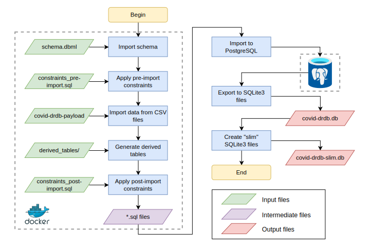

# COVID-DRDB Database

COVID-DRDB is created by the HIVDB team of Stanford University. It includes
resistance data of SARS-CoV-2 for convalescent plasma, vaccinee plasma and
monoclonal antibodies collected from published peer-reviewed/pre-print studies.
The database also provides meta-data including but not limited to:

- MAb targets, classes, epitopes
- Vaccine types, developers, efficacy
- Reference/article titles, DOIs, URLs
- Mutation references (Wuhan-Hu-1)

## Access DRDB

The access to DRDB database is open to the public. An end user can access this
database and summarize data via the [web
interface](https://covdb.stanford.edu/page/susceptibility-data/). This interface
is open source at [repository
hivdb/chiro-frontend](https://github.com/hivdb/chiro-frontend).

A SQLite dump file is created (almost) daily and can be retrieved from [Release
page of this repository](https://github.com/hivdb/covid-drdb-payload/releases).
Raw CSV data are available in the [hivdb/covid-drdb-payload][payload] repository.

[payload]: https://github.com/hivdb/covid-drdb-payload

This repository includes the code to validate the raw CSV data and generate 
SQLite dump files.

## Create & release DB files

1. Update CSV files in `payload/tables/` directory.
2. Use command `make autofill` to complete the CSV files. The command is
   incomprehensive, you may need to debug the code all the way.
4. Use command `make devdb log-devdb` to create a Postgres instance and verify
   the payload CSVs.
5. If #4 passed, use command `make release` or `make pre-release` to build and
   release SQLite db file. **Credential required**
6. DB files will be stored in *build* folder, [GitHub releases
   page](https://github.com/hivdb/covid-drdb-payload/releases), and s3
   repository s3://cms.hivdb.org/covid-drdb.

## How it works?

The Covid-DRDB is a SQL database built from CSV files stored in [a Git
repository hosted on GitHub](https://github.com/hivdb/covid-drdb-payload). The
rationale of storing CSV files in Git repository is to utilize Git's abilities
such as version control and [author/date
tracking](https://git-scm.com/docs/git-blame).

[The latest database
schema](https://github.com/hivdb/covid-drdb/blob/master/schema.dbml) is
maintained in this repository using the format of [DBML](https://www.dbml.org). 
This allows us to visualize the schema from the same source. This repository
also includes necessary scripts for creating, generating, and validating tables.
All these scripts are automated into an easy-to-use Makefile [described
above](#create--release-db-files). The first half of this pipeline is also
automatically [running on GitHub
CI](https://github.com/hivdb/covid-drdb-payload/actions/workflows/build.yml) as
our continuous integration.

## Contribute to DRDB

Any contributions are welcome here. Currently, we accept feature requests, new
study submissions and bug/error reports. We are still working on to provide a
pull-request pipeline for outside contributors to add data into our database
directly.

- Feature requests:
  - [Database][DBFR], adding new tables, new columns, etc.
  - [Website][WFR] (https://covdb.stanford.edu/search-drdb/)
- [New study submissions][NEWREF]
- Bug/error reports:
  - [Database][DBBUG]
  - [Website][WBUG]
  

[DBFR]: https://github.com/hivdb/covid-drdb/issues/new?assignees=philiptzou&labels=enhancement&title=[FR]
[WFR]: https://github.com/hivdb/chiro-frontend/issues/new?assignees=philiptzou&labels=enhancement&title=[FR]
[NEWREF]: https://github.com/hivdb/covid-drdb-payload/issues/new?assignees=KaimingTao&labels=enhancement&template=suggest-new-study.md&title=%5BNew%5D
[DBBUG]: https://github.com/hivdb/covid-drdb-payload/issues/new?assignees=KaimingTao%2C+philiptzou&labels=bug&template=data-error-report.md&title=%5BBUG%5D
[WBUG]: https://github.com/hivdb/chiro-frontend/issues/new?assignees=philiptzou&labels=bug&title=[BUG]
